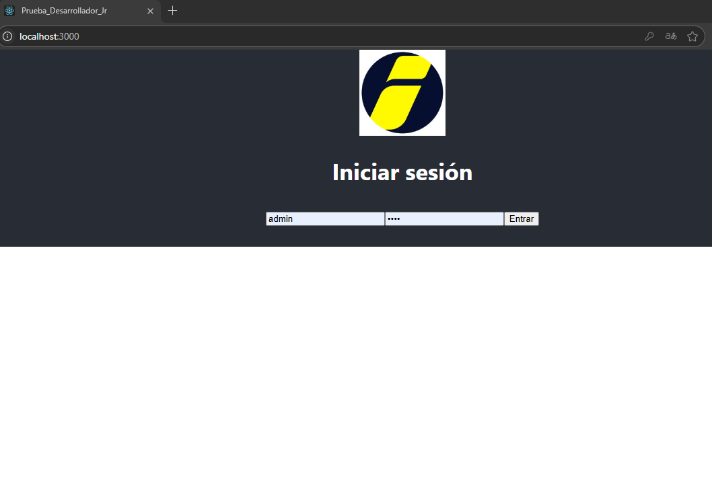
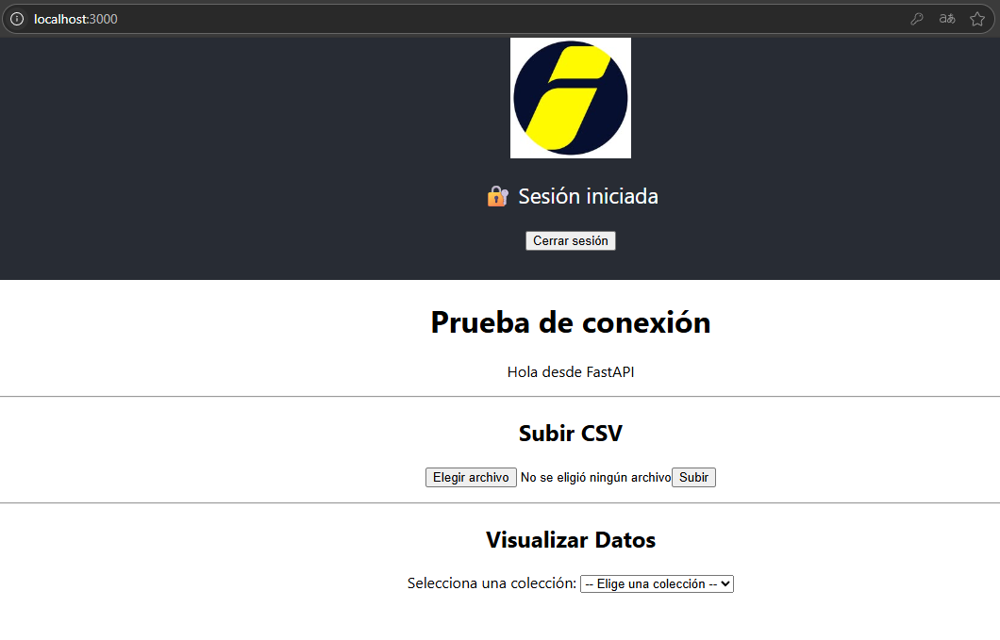
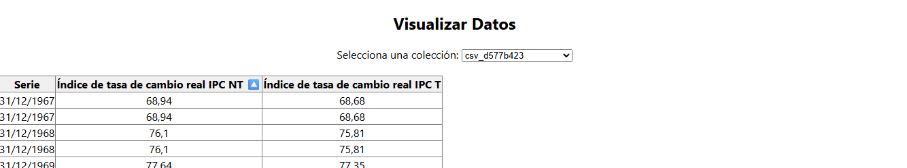
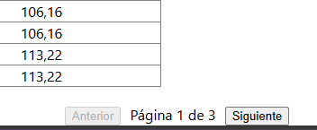

• • Se desarrollo usando:

Python 3.9.6

React: 19.1.0

MongoDB

• • Ruta para ejecutar el Backend ->

• • • • prueba_desarrollador_Jr/

python -m venv venv

venv\Scripts\activate 

pip install -r requirements.txt

cd backend

• • • • /backend/     (http://localhost:8000)

uvicorn app.main:app --reload

• • Ruta para ejecutar el Frontend ->

• • • • /frontend/ (http://localhost:3000)

npm install

npm start

• • Estructura del Proyecto

• • • • Backend (app/)

main.py	Define las rutas principales de la API

auth.py	Lógica JWT: login, crear/verificar token

db.py	Conexión a MongoDB

config.py	Variables de entorno

• • • • Frontend (src/)

App.js	Componente principal, maneja sesión y vistas

• • • • Frontend (src/pages)

Login.jsx	Formulario de login con manejo de token

Upload.jsx	Subida de archivos CSV

ViewData.jsx	Lista colecciones y muestra tablas paginadas

Home.jsx	Mensaje de bienvenida y prueba de API

Records.jsx	Vista alternativa para registros

• • • • Endpoints de la API

POST	/login	Devuelve token JWT

POST	/api/upload-csv	Subir archivo CSV

GET	/api/colecciones	Listar colecciones

GET	/api/registros/{coleccion}	Obtener datos de una colección

___________________________________________________________________________________

Se inician los proyectos, vamos a ver la siguente vista:

para fectos del ejercicio las credenciales son username=admin  password=1234

se autenticara y generara un token, lo que nos dara un aviso y veremos la siguiente vista:

se tiene una prueba de conexion lo que nos entrega el mensaje "Hola desde FastAPI", la subida del csv y una lista desplegable con las colecciones existentes que se pueden visualizar.

al seleccionar una coleccion, se puede dar click izq para ordenar desendente o asendente, ademas si son mas de 50 registros por vista, genera una paginacion.

___________________________________________________________________________________

Desarrollado por: Dario Delgado